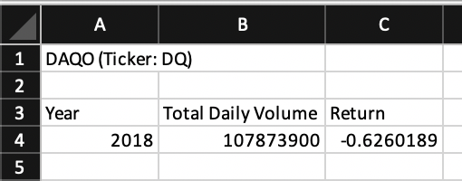
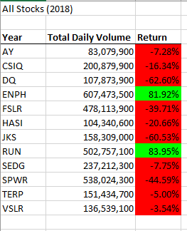
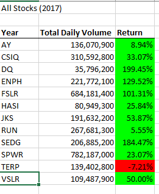

#### Stock-Analysis

**Overview of the Project

A stock is an investment that can have a great value to the investors. Therefor, in order to help the investors to make the right purchase we are here to analyse the dataset given to us. 

We have dataset of daily volume exchanged per stock, for the year of 2017, and 2018 which can easily reflect on value of the stock. Dataset included over 3000 daily records that can help us to to serve interest of client named Steve.

**Analysis and Results

First of all, our client Steve needed outcome of particular stock called "DADQ" with the ticker 'DQ'.
Here we created code for the total yearly traded volume based on the daily volumes for the ticker 'DQ'.
 
```Sub DQAnalysis()
Worksheets("DQAnalysis").Activate
Range("A1").Value = "DAQO (Ticker: DQ)"
'Create a header row
Cells(3, 1).Value = "Year"
Cells(3, 2).Value = "Total Daily Volume"
Cells(3, 3).Value = "Return"  
Worksheets("2018").Activate
totalVolume = 0

Dim startingPrice As Double
Dim endingPrice As Double
rowStart = 2
'DELETE: rowEnd = 3013
'rowEnd code taken from https://stackoverflow.com/questions/18088729/row-count-where-data-exists
rowEnd = Cells(Rows.Count, "A").End(xlUp).Row

For i = rowStart To rowEnd
   'increase totalVolume
    If Cells(i, 1).Value = "DQ" Then
       totalVolume = totalVolume + Cells(i, 8).Value
       End If
    If Cells(i - 1, 1).Value <> "DQ" And Cells(i, 1).Value = "DQ" Then
           startingPrice = Cells(i, 6).Value
       End If
       If Cells(i + 1, 1).Value <> "DQ" And Cells(i, 1).Value = "DQ" Then
           endingPrice = Cells(i, 6).Value
       End If
Next i
   Worksheets("DQAnalysis").Activate
   Cells(4, 1).Value = 2018
   Cells(4, 2).Value = totalVolume
   Cells(4, 3).Value = (endingPrice / startingPrice) - 1
End Sub
```


> After run the code we come across the result clearly stated that "DAQO" dropped over 63% in 2018. Therefor, we need to find better choice for Steve. Let's analysis all the stocks.

Here is the code we are going to use which has the same step as DQ but for all the tickers.

```Dim startTime As Single
Dim endTime  As Single
Worksheets("AllStocksAnalysis").Activate
yearValue = InputBox("What year would you like to run the analysis on?")
startTime = Timer
Range("A1").Value = "All Stocks (" + yearValue + ")"

'Create a header row
Cells(3, 1).Value = "Year"
Cells(3, 2).Value = "Total Daily Volume"
Cells(3, 3).Value = "Return"

Dim tickers(12) As String

   tickers(0) = "AY"
   tickers(1) = "CSIQ"
   tickers(2) = "DQ"
   tickers(3) = "ENPH"
   tickers(4) = "FSLR"
   tickers(5) = "HASI"
   tickers(6) = "JKS"
   tickers(7) = "RUN"
   tickers(8) = "SEDG"
   tickers(9) = "SPWR"
   tickers(10) = "TERP"
   tickers(11) = "VSLR"
   
Dim startingPrice As Single
Dim endingPrice As Single
Worksheets(yearValue).Activate
rowCount = Cells(Rows.Count, "A").End(xlUp).Row
   
   For i = 0 To 11
    ticker = tickers(i)
    totalVolume = 0   
    Worksheets(yearValue).Activate
       For j = 2 To rowCount
          'total volume for ticker
          If Cells(j, 1).Value = ticker Then
              totalVolume = totalVolume + Cells(j, 8).Value
          End If
          'starting price for ticker
          If Cells(j - 1, 1).Value <> ticker And Cells(j, 1).Value = ticker Then
              startingPrice = Cells(j, 6).Value
          End If
          'ending price for ticker
          If Cells(j + 1, 1).Value <> ticker And Cells(j, 1).Value = ticker Then
              endingPrice = Cells(j, 6).Value
          End If
       Next j
    Worksheets("AllStocksAnalysis").Activate
       
       Cells(4 + i, 1).Value = ticker
       Cells(4 + i, 2).Value = totalVolume
       Cells(4 + i, 3).Value = (endingPrice / startingPrice) - 1
   Next i
   endTime = Timer
   MsgBox "This code ran in " & (endTime - startTime) & " seconds for the year " & (yearValue) 
End Sub 
```
Result of 2018:




Result of 2017



As a Data Anaylist we have to make readable outcome for the client, so in this case we made green highlighted cells are positive and reds are negative returns. Also, we have created buttons for Steve which made super user-friendly. 


